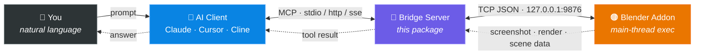
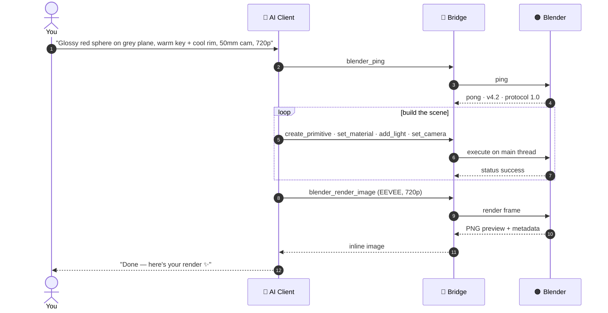

<!-- ═══════════════════════════ HEADER ═══════════════════════════ -->
<div align="center">

<a href="https://github.com/Aayushdubey101/Blender-MCP">
  
</a>

<a href="https://github.com/Aayushdubey101/Blender-MCP">
  
</a>

<br/>

<a href="https://github.com/Aayushdubey101/Blender-MCP/releases"></a>


<a href="LICENSE"></a>
<a href="https://docs.astral.sh/uv/"></a>

<br/><br/>

**[What it is](#-what-this-is) · [Why not the alternative](#-why-use-this-instead-of-ahujasidblender-mcp) · [Tools](#-tools-v041) · [Quick start](#-quick-start) · [Config](#-configuration) · [Docker](#-docker) · [Architecture](#-project-layout)**

</div>

<!-- ═══════════════════════════════════════════════════════════════ -->

> **Production-grade Blender automation over the Model Context Protocol.**
> Pydantic-validated • Zero telemetry • Async-native • Pytest-covered • Plugin-extensible
>
> Sibling project in the [MCP-HUB](https://github.com/Aayushdubey101/MCP-HUB) collection.

---

## 🎯 What this is

`blender-mcp` connects Blender 3D to any MCP-compatible AI assistant
(Claude Desktop, Claude Code, Cursor, Continue, Cline, …). After a one-time
setup, you tell the assistant what you want, and it drives Blender for you —
creating objects, applying materials, lighting the scene, framing cameras,
rendering. **The assistant takes the wheel; you watch it work.**



Two halves:
- **Bridge server** (this Python package, run via `uv`) — speaks MCP to the AI client.
- **Blender addon** (`blender_addon/blender_mcp.py`) — runs inside Blender, executes commands on the main thread.

---

## ⚔️ Why use this instead of `ahujasid/blender-mcp`?

The `blender-mcp` project pioneered the space. We respect that. We're built
for a different audience: **studios, technical artists, and pipeline engineers
who need verifiable, auditable, production-grade tooling.**

| Dimension | ✅ `blender-mcp` (this) | `ahujasid/blender-mcp` |
|---|---|---|
| Telemetry | **None.** Zero phone-home. | Default-on Supabase telemetry |
| Input validation | Pydantic v2 with `extra="forbid"` everywhere | None — raw kwargs |
| Async runtime | Native `asyncio`, non-blocking | Synchronous `socket.recv` |
| Tests | **207 passing**, 90% coverage | None visible in repo |
| CI | GitHub Actions on Python 3.10 / 3.11 / 3.12 | None |
| Architecture | Modular package, ~8 files | Monolithic 1186-line `server.py` |
| Tool annotations | All 4 MCP hints on every tool | Mostly omitted |
| Read-only mode | `BLENDER_MCP_READ_ONLY=true` | None |
| Structured logging | `BLENDER_MCP_LOG_FORMAT=json` | Plain strings |
| Protocol versioning | `BRIDGE_PROTOCOL_VERSION="1.0"` enforced | None |
| Docker | `Dockerfile` + `docker-compose.yml` | None |
| Hardcoded third-party keys | **None** — bring your own | `RODIN_FREE_TRIAL_KEY` baked into source |
| Asset integrations | Plugin packages (opt-in, separately versioned) | Baked into core |

If telemetry, validation, tests, audit-ability, or air-gapped deployment matter
to you, this is the one to use.

---

## 🧰 Tools (v0.4.1)

**15 core tools**, all Pydantic-validated with full MCP annotations, plus opt-in plugin packs.

<details open>
<summary><b>🔍 Inspection — read-only (5)</b></summary>

<br/>

| Tool | Purpose |
|------|---------|
| `blender_ping` | Confirm Blender + addon reachable, returns versions and protocol |
| `blender_get_scene_info` | Scene name, frame range, render engine, object count |
| `blender_list_objects` | List objects, optional filter by type (`MESH`, `LIGHT`, `CAMERA`, …) |
| `blender_get_object_info` | Full per-object detail (transform, dimensions, materials, mesh/light/camera specifics) |
| `blender_get_viewport_screenshot` | Inline PNG of the active viewport |

</details>

<details>
<summary><b>🛠️ Authoring — destructive, disabled in read-only mode (8)</b></summary>

<br/>

| Tool | Purpose |
|------|---------|
| `blender_create_primitive` | Cube / sphere / cylinder / cone / plane / torus / monkey |
| `blender_transform_object` | Set location / rotation / scale (any subset) |
| `blender_delete_object` | Remove by name (idempotent) |
| `blender_set_material` | Principled BSDF: RGBA, metallic, roughness, optional emission |
| `blender_add_light` | POINT / SUN / SPOT / AREA with per-type parameters |
| `blender_set_camera` | Location, aim target, focal length, set-active |
| `blender_render_image` | Render a frame; returns metadata + inline PNG preview |
| `blender_execute_python` | Power-user escape hatch (`bpy` available, set `result` to return) |

</details>

<details>
<summary><b>💾 File management (2)</b></summary>

<br/>

| Tool | Purpose |
|------|---------|
| `blender_save_file` | Save the current `.blend` (optional target path) |
| `blender_open_file` | Open a `.blend` from disk |

</details>

### 🔌 Plugins — opt-in, separately installable

Each plugin is a pip package that registers additional tools via the entry-point
system. Install only what you need. All require **zero** pre-configured secrets
at server startup — keys are checked at *call time*, so the server always boots
cleanly.

<details>
<summary><b>🟢 <code>blender-mcp-polyhaven</code> — free, no key needed (5)</b></summary>

<br/>

| Tool | Purpose |
|------|---------|
| `polyhaven_status` | Check plugin status and cache directory |
| `polyhaven_categories` | List asset categories (hdris / textures / models) |
| `polyhaven_search` | Search PolyHaven's library |
| `polyhaven_download` | Download an asset to local cache |
| `polyhaven_apply_texture` | Download + apply texture to an object in Blender |

```bash
pip install blender-mcp-polyhaven
```

</details>

<details>
<summary><b>🔷 <code>blender-mcp-hyper3d</code> — requires <code>HYPER3D_API_KEY</code> (5)</b></summary>

<br/>

| Tool | Purpose |
|------|---------|
| `hyper3d_status` | Check plugin status and API key configuration |
| `hyper3d_generate_text` | Text → 3D model via Rodin API |
| `hyper3d_generate_image` | Image → 3D model (URL or local file) |
| `hyper3d_poll` | Poll generation status with exponential backoff |
| `hyper3d_import` | Poll + download + import GLTF/FBX/OBJ/STL into Blender |

```bash
pip install blender-mcp-hyper3d
export HYPER3D_API_KEY="your-key"  # https://hyper3d.ai
```

</details>

<details>
<summary><b>🟣 <code>blender-mcp-sketchfab</code> — requires <code>SKETCHFAB_API_KEY</code> for downloads (4)</b></summary>

<br/>

| Tool | Purpose |
|------|---------|
| `sketchfab_status` | Check plugin status and API key configuration |
| `sketchfab_search` | Search Sketchfab's 3D model library by keyword |
| `sketchfab_preview` | Get full metadata for a model by UID |
| `sketchfab_download` | Download GLTF + import into Blender |

```bash
pip install blender-mcp-sketchfab
export SKETCHFAB_API_KEY="your-token"  # https://sketchfab.com/settings#password
```

</details>

---

## 🚀 Quick start

### Prerequisites

- **Blender 3.0+** (3.6, 4.0, 4.2 LTS all tested)
- **Python 3.10+**
- **[uv](https://docs.astral.sh/uv/)** package manager
  ```powershell
  # Windows
  powershell -ExecutionPolicy ByPass -c "irm https://astral.sh/uv/install.ps1 | iex"
  ```
  ```bash
  # macOS / Linux
  curl -LsSf https://astral.sh/uv/install.sh | sh
  ```

### 0 · Clone

```bash
git clone https://github.com/Aayushdubey101/Blender-MCP.git
cd Blender-MCP
```

### 1 · Install dependencies

From the repo root:

```bash
uv sync
```

### 2 · Install the Blender addon

1. Open Blender → **Edit → Preferences → Add-ons → Install…**
2. Pick `blender_addon/blender_mcp.py`
3. Tick the checkbox next to **"Development: Blender MCP"**
4. In the 3D viewport press **N** → **MCP** tab → **▶ Start MCP Bridge**

You should see in Blender's system console:

```
[MCP Bridge] Listening on 127.0.0.1:9876
```

### 3 · Smoke-test the server

```bash
uv run blender-mcp
```

It will block on stdin — that's correct (MCP stdio transport).
Press Ctrl-C. A clean run with no errors means you're good.

For a full interactive test, use the official inspector:

```bash
npx @modelcontextprotocol/inspector uv run blender-mcp
```

### 4 · Wire it into your AI client

A ready-to-copy template is at [`.mcp.json.example`](.mcp.json.example).
Copy it, rename to `.mcp.json` (gitignored), and replace the path.

Replace `<path-to-Blender-MCP>` with the **absolute path** to this repo
(e.g. `C:\Projects\Blender-MCP` on Windows, `/home/you/Blender-MCP` on Linux/macOS).

<details>
<summary><b>Claude Desktop</b></summary>

<br/>

`%APPDATA%\Claude\claude_desktop_config.json` (Windows) or
`~/Library/Application Support/Claude/claude_desktop_config.json` (macOS):

```json
{
  "mcpServers": {
    "blender": {
      "command": "uv",
      "args": [
        "--directory",
        "<path-to-Blender-MCP>",
        "run",
        "blender-mcp"
      ]
    }
  }
}
```

</details>

<details>
<summary><b>Claude Code (CLI)</b></summary>

<br/>

```bash
claude mcp add blender -- uv --directory <path-to-Blender-MCP> run blender-mcp
```

Or add manually to `~/.claude/settings.json`:

```json
{
  "mcpServers": {
    "blender": {
      "command": "uv",
      "args": ["--directory", "<path-to-Blender-MCP>", "run", "blender-mcp"]
    }
  }
}
```

</details>

<details>
<summary><b>Cursor / Cline / Continue / any MCP client</b></summary>

<br/>

`.cursor/mcp.json` (or the equivalent config file for your client):

```json
{
  "mcpServers": {
    "blender": {
      "command": "uv",
      "args": ["--directory", "<path-to-Blender-MCP>", "run", "blender-mcp"]
    }
  }
}
```

Same shape everywhere — `command: uv`, `args: [--directory <path>, run, blender-mcp]`. See your client's MCP docs for the exact config file.

</details>

### 5 · Drive Blender with natural language

With Blender open, addon enabled, **Start MCP Bridge** running, and your AI
client restarted — just ask. The assistant picks the right tools, validates
inputs, and executes. You sit back.

```
You: Build a still-life scene. Put a glossy red sphere on a matte grey plane,
     light it with a warm key light from the right and a cool rim from behind,
     frame a 50mm camera looking down at 30°, then render at 720p with EEVEE.
```

...and here is the exact tool flow the assistant drives:



---

## ⚙️ Configuration

Every option is an environment variable. None are required; all have
sensible defaults. Copy `.env.example` to `.env` to customize.

| Variable | Default | Purpose |
|---|---|---|
| `BLENDER_MCP_HOST` | `127.0.0.1` | Where the Blender addon is listening |
| `BLENDER_MCP_PORT` | `9876` | Same — match the N-panel value |
| `BLENDER_MCP_LOG_LEVEL` | `INFO` | `DEBUG` / `INFO` / `WARNING` / `ERROR` |
| `BLENDER_MCP_LOG_FORMAT` | `text` | `text` for humans, `json` for log infra |
| `BLENDER_MCP_READ_ONLY` | `false` | `true` disables every destructive tool |

### Read-only mode (safe demos)

```bash
BLENDER_MCP_READ_ONLY=true uv run blender-mcp
```

`blender_create_primitive`, `blender_render_image`, `blender_execute_python`, etc.
all return a structured "read-only mode" error. Inspection tools still work.

### JSON logging (log infra)

```bash
BLENDER_MCP_LOG_FORMAT=json uv run blender-mcp
```

Each line is a single JSON object — ship straight to Loki / Datadog / CloudWatch.

---

## 🐳 Docker

For headless / render-farm setups. The container talks to a Blender instance
running on the host:

```bash
docker compose up --build
```

The Blender addon must be running on the host (`host.docker.internal:9876`
inside the container). On Linux the compose file already maps
`host.docker.internal` to `host-gateway`.

---

## 📂 Project layout

```
Blender-MCP/
├── src/blender_mcp/
│   ├── server.py              # MCP entry point; transport (stdio / http / sse)
│   ├── client.py              # Async TCP client, per-call + persistent modes
│   ├── schemas.py             # Pydantic v2 input models
│   ├── utils.py               # format_error / format_success / read-only guard
│   ├── plugins/               # Plugin loader + BlenderMCPPlugin Protocol
│   ├── _log_formatter.py      # JSON log formatter
│   └── tools/
│       ├── scene.py           # inspection + file-management tools
│       ├── objects.py         # destructive object/material/light/camera tools
│       ├── render.py          # blender_render_image
│       └── code.py            # blender_execute_python (escape hatch)
├── blender_addon/
│   └── blender_mcp.py  # Install this in Blender
├── plugins/
│   ├── polyhaven/             # pip install blender-mcp-polyhaven
│   ├── hyper3d/               # pip install blender-mcp-hyper3d
│   └── sketchfab/             # pip install blender-mcp-sketchfab
├── tests/                     # core test suite
├── docs/
│   └── ARCHITECTURE.md        # Process model, threading, response shape, extensibility
├── examples/
│   └── direct_client_test.py  # Drive the bridge without an MCP client
├── Dockerfile
├── docker-compose.yml
├── pyproject.toml             # uv / build configuration
├── .env.example
├── CHANGELOG.md
├── LICENSE
└── README.md
```

For deeper internals see [`docs/ARCHITECTURE.md`](docs/ARCHITECTURE.md).

---

## 🧪 Development

```bash
uv sync --extra dev          # install dev deps
uv run pytest                # core tests, ~2s
uv run pytest --cov=src      # with coverage
uv run ruff check src/       # lint
uv run ruff format src/      # format
uv run mypy src/             # type-check

# Run plugin tests
uv run pytest plugins/polyhaven/tests/    # 23 tests
uv run pytest plugins/hyper3d/tests/      # 44 tests
uv run pytest plugins/sketchfab/tests/    # 33 tests
```

CI runs the same matrix on every push (Python 3.10 / 3.11 / 3.12).

---

## 🗺️ Roadmap

- **v0.3.0** ✅ — Plugin architecture, PolyHaven + Hyper3D + Sketchfab plugins, persistent connection, HTTP transport.
- **v0.4.x** ✅ — SHA256 asset cache, headless `--background` Blender control, file management tools.
- **v1.0.0** — Final polish, full comparison table green on every row.

---

## 🔧 Troubleshooting

<details>
<summary><b>"Could not connect to Blender at 127.0.0.1:9876"</b></summary>

Open Blender, Preferences → Add-ons, enable *Blender MCP*, then in the
3D viewport's N-panel → MCP tab → click **▶ Start MCP Bridge**.

</details>

<details>
<summary><b>"Port already in use"</b></summary>

Change the port in the addon N-panel and set `BLENDER_MCP_PORT` to match.

</details>

<details>
<summary><b>"Tools don't show up in Claude Desktop"</b></summary>

Verify the absolute path in `claude_desktop_config.json`, then fully quit and
relaunch Claude Desktop (Cmd-Q / right-click tray icon → Quit).

</details>

<details>
<summary><b>"Render timed out"</b></summary>

Pass `timeout_seconds=600` (or higher) on the `blender_render_image` call for
heavy Cycles renders. Default is 300s.

</details>

<details>
<summary><b>"Protocol version mismatch"</b></summary>

Re-install `blender_addon/blender_mcp.py` in Blender — your addon and
server are out of sync.

</details>

---

## ⭐ Star history

<div align="center">

<a href="https://star-history.com/#Aayushdubey101/Blender-MCP&Date">
  
</a>

</div>

---

## 📜 License

MIT — see [`LICENSE`](LICENSE).

<div align="center">


</div>
